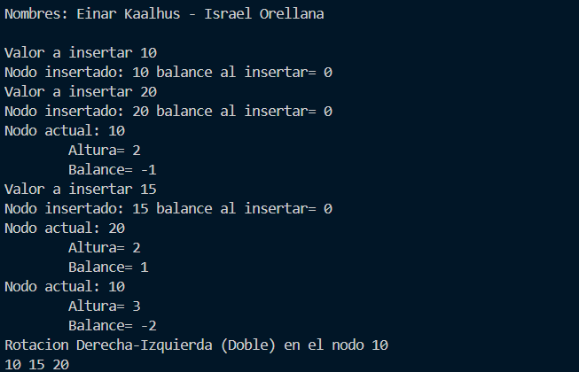

# Práctica de ARBOLES BINARIOS

## 📌 Información General

- **Título:** Arboles Binarios
- **Asignatura:** Estructura de Datos  
- **Carrera:** Computación  
- **Estudiantes:** Israel Orellana 
- **Fecha:**  26 de junio del 2025  
- **Profesor:** Ing. Pablo Torres  

---

## 📌 Características principales

- Inserción de nodos con auto-balanceo.
- Cálculo de altura y factor de balance de cada nodo.
- Rotaciones simples y dobles (izquierda y derecha).
- Recorrido **in-order** para mostrar los elementos en orden.
- Verificación básica del equilibrio del árbol.

---

---

## 🧠 Funcionamiento

### 🔁 Inserción de nodos
Cada vez que se inserta un nuevo valor, el árbol recalcula la altura y el **factor de balance** de los nodos afectados para decidir si es necesario aplicar alguna de las siguientes rotaciones:

1. **Rotación Derecha (simple)**  
2. **Rotación Izquierda (simple)**  
3. **Rotación Izquierda-Derecha (doble)**  
4. **Rotación Derecha-Izquierda (doble)**  

## 📈 Gráfico Generado

---
